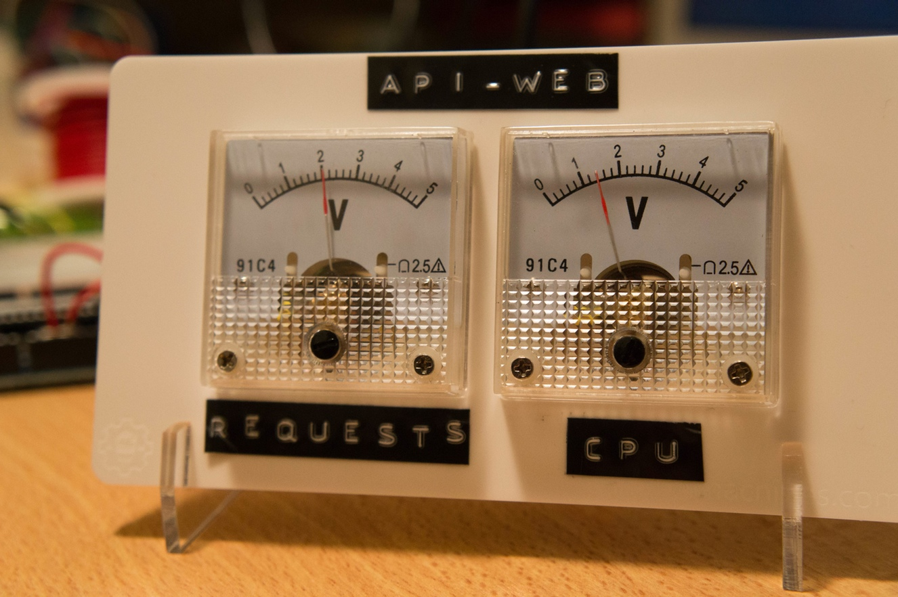
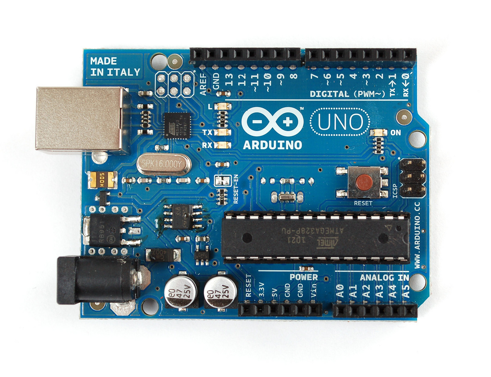
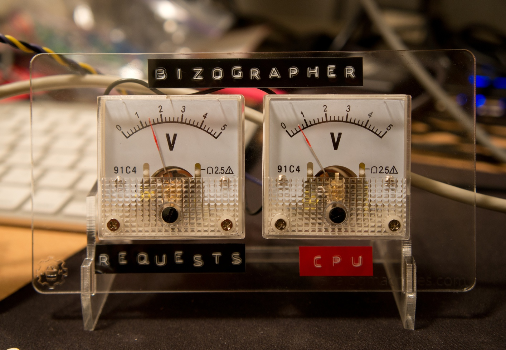
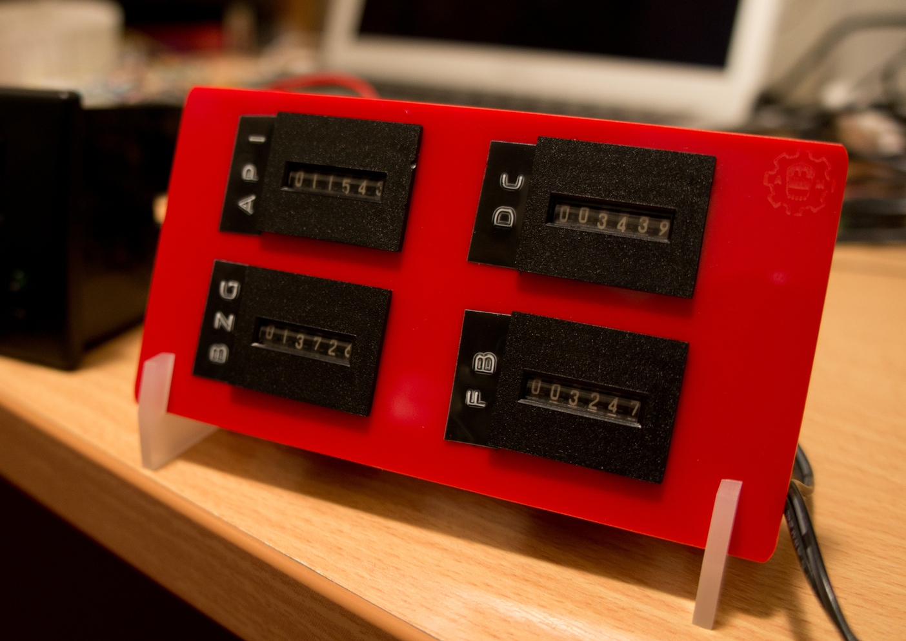
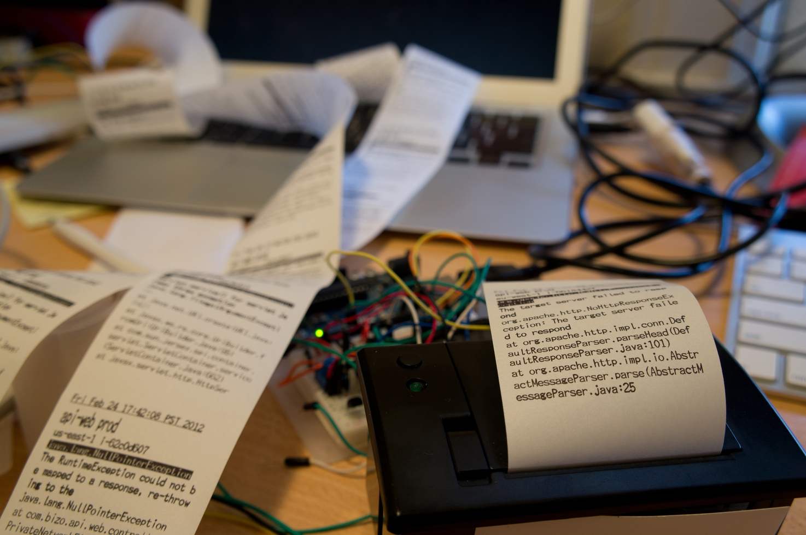
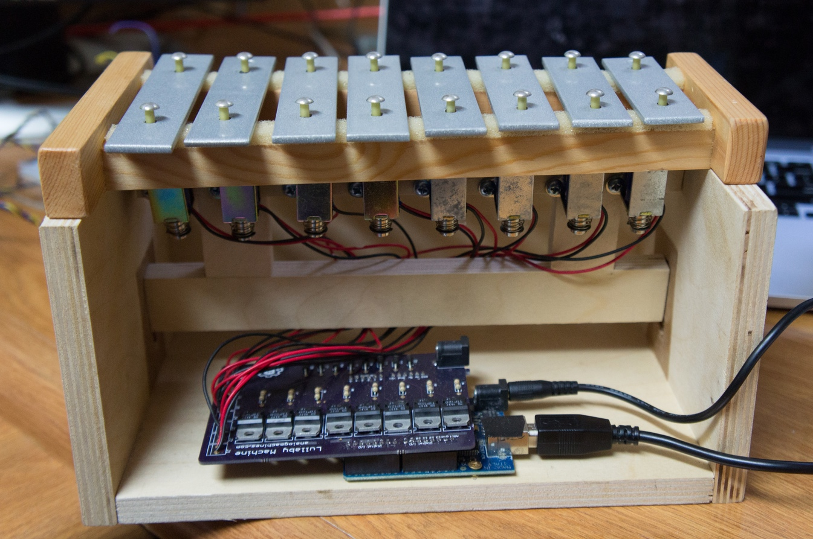
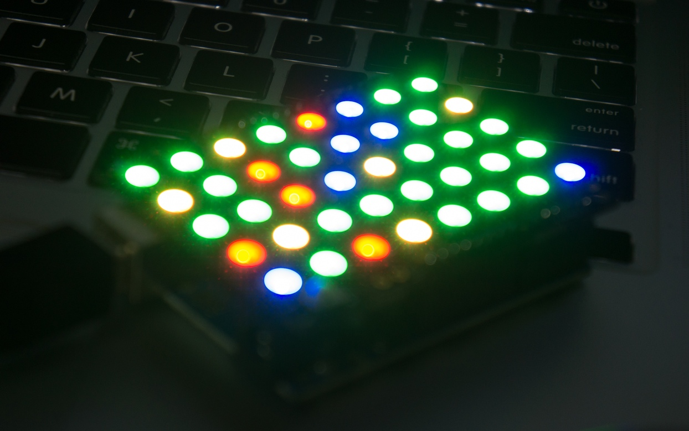

# Analog Operational Displays



---
# Why?

fun!
engaging!
becomes part of your environment!
learn surprising things!
use other senses!
constraints drive creativity!


---

# Goals

- Inspire you to create your own analog displays
- Convice you it's _**easy**_!
- Give you a starting point

---

# Agenda

1. quick intro to technologies used
2. cover 5 analog metric display projects
3. short discussion of alternate hardware plaforms

---

# Technologies used
arduino
python
aws: cloudwatch, sqs, ec2, ...

---

# Arduino



^ 
- open source, cross-platform microcontroller platform
- great community, lots of examples
- in-expensive - $25, $15 clone
- 32K flash, 2K ram

---

# Arduino Hello World

```c
// Pin 13 has an LED connected on most Arduino boards.
int led = 13;

// the setup routine runs once when you press reset:
void setup() {				
  // initialize the digital pin as an output.
  pinMode(led, OUTPUT);	 
}

// the loop routine runs over and over again forever:
void loop() {
  digitalWrite(led, HIGH); // turn the LED on (HIGH is voltage level)
  delay(1000);             // wait for a second
  digitalWrite(led, LOW);  // turn the LED off by making voltage LOW
  delay(1000);             // wait for a second
}
```


^ 
- Can use C/C++
- Lots of examples, libraries

---

# Communication

Arduino has built-in USB serial

ethernet, wifi, bluetooth possible

---

# Firmata

Generic protocol for communicating with microcontrollers.

Client and device libraries

Makes it very easy to create _'dumb'_ devices.

Great for prototyping!


^ 
Load generic arduino sketch
easy to extend with custom functionality

---

# pyFirmata

https://github.com/tino/pyFirmata

```python
from pyfirmata import Arduino
import time

arduino = Arduino('/dev/tty.usbmodem1421')
led = arduino.get_pin('d:13:o')

while True:
  led.write(1)
  time.sleep(1)
  
  led.write(0)
  time.sleep(1)
```

^ 
specify USB serial device
digital pin 13, output

---

# Now you know

- how to blink an LED on an arduino
- how to make your _computer_ tell the _arduino_ to blink an LED

_**Go out and make a display!**_

---


# 5 Display projects

---



^Analog meters
- great, classic look!
- would be better with custom faceplates!
- disappointing with cw 60 second resolution
- difficulty: LOW!

---

```python
import boto.ec2.cloudwatch
from pyfirmata import Arduino

cw = boto.ec2.cloudwatch.connect_to_region("us-east-1")

def cpu_utilization(name):
  return cw.get_metric_statistics(60, .., ..,
    'CPUUtilization', 'AWS/EC2', 'Average',
      {'AutosScalingGroupName': name})[0]["Average"]

arduino = Arduino('/dev/tty.usbmodem1421')
cpu_pin = arduino.get_pin('d:5:p')

while True:
    cpu = cpu_utilization("my-group-name")
    cpu_pin.write(cpu / 100)
    
    time.sleep(10)
```

^ 
arduino running 'StandardFirmata' example sketch
cw call truncated, otherwise full code
USB serial device
digital pin 5, PWM mode

---



^ Event Counters
electromechanical counter
only goes up!  no reset
not super useful for display...
BUT, makes great loud clicking noise when advancing -- you HEAR something is happening
think: train station

---



^ Exception printer
apps log exceptions to SNS, SNS->SQS, printer polls SQS
+ started as a joke - short order cook
interesting:
 - printer noise is a signal of activity.
 - size of trail indicator of system health

---



^ 
computer controlled xylophone
solenoids (linear motor, electromagnetic)
different messages/events can play different note sequences
mostly a novelty, but, fun to play

---



^ Instance grid
work in progress
not sure it's useful
wanted to show breakdown by as group
 - lots of colors, but what's the key?
 - limited space, need lots of displays (# machines, regions)

---


## Alternative (More Modern?) Platforms

Raspberry Pi
Spark Core

^ 
rasp - $40, ARM, 512MB ram! real OS! device support! ethernet, video, audio and GPIO
spark - $40, ARM, 20k ram, wifi
electic imp - $45, cortex-m3, wifi
arduino still great, cheap platform, great way to get started

---

# raspberry pi GPIO

```bash
#!/bin/bash
# Blink LED on pin 0

gpio mode 0 out   # set pin 0 to output mode

while true; do
  gpio write 0 1  # set pin 0 HIGH (turn on)
  sleep 1
  
  gpio write 0 0  # set pin 0 LOW (turn off)
  sleep 1
done
```

---

#spark core tinker API

```bash
# Core ID is 0123456789abcdef01234567
# Your access token is 12341234
curl https://api.spark.io/v1/devices/0123456789abcdef01234567/digitalwrite \
  -d access_token=12341234 -d params=D0,HIGH
```

---


# Maker Faire
## May 17-18
### San Mateo Event Center
### Get _**seriously**_ Inspired!


---

# Questions/Comments?

http://github.com/ogrodnek/analog-metrics-talk

## Send me info on your analog displays!

ogrodnek@gmail.com
http://analogmachines.com/blog/
http://dev.bizo.com


